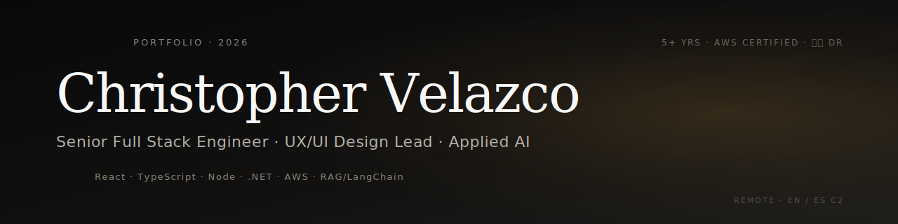

<!-- This file goes into the special Christopher-37/Christopher-37 repo as README.md -->
<!-- Banner image path assumes you upload banner.svg to the same repo's root -->

  

  
  
  
  

---

## About

Senior Full Stack Engineer and UX/UI Design Lead with **5+ years** shipping production software for enterprise banks, insurers, and growth-stage teams. Design-minded by training, engineering-minded by craft — equally at home in Figma and in a typed codebase.

Based in the Dominican Republic. Remote-first across time zones. AWS Certified. Bilingual (English C2 / Spanish native).

I work best at the seam between product, design, and engineering — translating ambiguous problems into systems people can actually use, then making those systems durable enough to maintain in production.

## What I do

- 🧱 **Full-stack delivery** — React + TypeScript on the front, Node.js or .NET on the back, AWS underneath
- 🎨 **Design systems** — building shared component libraries with real tokens, real accessibility, real documentation
- 🤖 **Applied AI** — production RAG pipelines, LangChain agents, LLM integrations that pass code review
- 🧠 **Technical mentorship** — code reviews, architecture decisions, pairing developers up the learning curve
- 🌐 **Remote-first collaboration** — sync across time zones with stakeholders, designers, and engineers

## Selected work

### Personal portfolio — design system, i18n, working backend

A typed SPA that doubles as a working demonstration of the stack. React + TypeScript + Tailwind + Supabase with bilingual content, keyboard-first navigation, a functional contact pipeline, and an in-page chatbot. Migrated from Bolt.host to Vercel for portability and cost.

🔗 **Live:** [web-portfolio-cvelazco.vercel.app](https://web-portfolio-cvelazco.vercel.app/)

### Entipedia MVP — full-stack project management

Next.js + TypeScript + PostgreSQL platform for project management workflows. Built end-to-end with attention to data modeling, API design, and the small UX details that make internal tools tolerable to use.

🔗 **Repo:** [Christopher-37/entipedia-mvp-public](https://github.com/Christopher-37/entipedia-mvp-public)

## Tech stack

### Frontend

### Backend & data

### Cloud, AI, tooling

## Currently exploring

- Production patterns for agentic LLM workflows (multi-step tool use, eval pipelines, cost-aware routing)
- Edge-first architectures with Cloudflare Workers + D1
- Sharper distinctions between design systems that scale and design systems that just look organized

## Credentials

- **AWS Certified Cloud Practitioner** — [verify on Credly](https://www.credly.com/badges/404f73a3-91b6-4847-803c-752dbae6a33f/linked_in_profile)
- **Associate AI Engineer for Developers** — [DataCamp](https://www.datacamp.com/certificate/AIEDA0017113952449)
- **EFSET English Certificate** — [C2 Proficient](https://cert.efset.org/sFxBn1)

## Contact

The fastest paths in:

- 📧 **Email** — [chrisjvelazco@gmail.com](mailto:chrisjvelazco@gmail.com)
- 💼 **LinkedIn** — [linkedin.com/in/christopher-velazco](https://www.linkedin.com/in/christopher-velazco/)
- 🌐 **Portfolio** — [web-portfolio-cvelazco.vercel.app](https://web-portfolio-cvelazco.vercel.app/)
- 📄 **Résumé** — [PDF](https://web-portfolio-cvelazco.vercel.app/EN_Christopher_Velazco_Software_Developer_resume.pdf)

I respond within one business day for serious enquiries. Open to senior IC roles, technical lead positions, and design-system or applied-AI engagements.

  If you found something useful in one of my repos, a ⭐ goes a long way. Thanks for reading.

